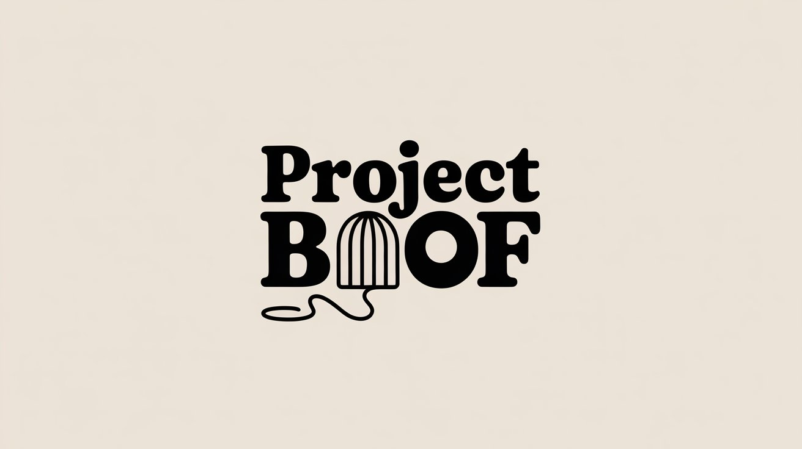

<p align="center">
  
</p>

HarmonaQuery is a system for harmonizing and querying genomic and clinical data from multiple public sources to support 
Real World Evidence (RWE) analysis and virtual cohort aggregation. The project integrates data from cancer genomics 
databases (cBioPortal, TCGA, COSMIC), variant interpretation resources (ClinVar, ClinGen), and gene-disease curation 
repositories (GenCC, OncoKB) to enable comprehensive multi-source queries for precision medicine research.

## Project Setup
### Basic steps
- Install Python 3.9+ and ensure `make`, `curl`, and standard SSL certificates are available on your system.
- Confirm outbound HTTPS connectivity and sufficient disk space (>15 GB recommended; ClinVar XML bundles are ~5 GB each).
- Clone the repo and stay at the project root (`/Users/joeflack4/projects/harmonaquery`). Raw data lands under `data/raw/` (ignored by Git).
- Review the source overview in [`docs/data-sources.md`](docs/data-sources.md) for acquisition notes and licensing details.

### Download source data
- **All sources:** `make download-sources` (fetches cBioPortal PanCan Atlas BRCA & LUAD bundles, ClinGen public files, ClinVar monthly releases, and TCGA open-access data).
- **Per source:**
  - `make download-cbioportal`
  - `make download-clingen`
  - `make download-clinvar`
  - `make download-tcga`
- **Install GDC client:** `make install-gdc-client` (required for TCGA downloads)
- After each run, inspect the per-source manifests in `data/raw/<source>/manifest.json` for SHA-256 checksums, file sizes, and provenance timestamps.

## Analyses

### Preliminary Data Analysis

The preliminary analysis system comprehensively profiles all downloaded data sources to inform harmonization strategy. 
It analyzes tabular (CSV/TSV), semi-structured (JSON/XML), and provides cross-source field mapping suggestions.

**What it does:**
- Infers data types and calculates field-level statistics (nulls, cardinality, distributions)
- Detects biomedical identifiers (HGNC, MONDO, OMIM, dbSNP, ClinVar)
- Analyzes JSON/XML structure and schema
- Extracts entities (genes, diseases, variants) across sources
- Suggests field mappings based on name similarity and data patterns
- Generates JSON reports, Markdown summaries, and visualizations

**Run analysis:**
```bash
# Analyze all sources (comprehensive)
make preliminary-analysis

# Or run specific phases:
make analyze-phase2  # Tabular data (CSV/TSV)
make analyze-phase3  # Semi-structured (JSON/XML)

# Analyze single file
python3 analysis/cli.py file <path-to-file>

# Run with sampling for faster analysis
python3 analysis/cli.py file <path-to-file> --sample 1000
```

**Outputs:** Results in `output/preliminary-analysis/sources/` with JSON profiles, Markdown reports, and PNG visualizations for each analyzed file.

**See:** [`notes/preliminary-analysis.md`](notes/preliminary-analysis.md) for specification and [`notes/preliminary-analysis-complete-summary.md`](notes/preliminary-analysis-summary-final.md) for implementation details.

## Data Sources

HarmonaQuery integrates data from seven major genomic and clinical databases. Each source provides complementary 
information for comprehensive precision medicine analysis. For complete details, see [`docs/data-sources.md`](docs/data-sources.md).

### cBioPortal
Open-source platform for exploring multidimensional cancer genomics data with >1.4M samples and >38M mutations across 
multiple molecular data types (mutations, CNAs, expression, fusions) and clinical annotations. See [docs/data-sources/cbioportal.md](docs/data-sources/cbioportal.md).

### ClinGen
NIH-funded clinical genome resource defining clinical relevance of genes and variants, featuring expert-curated 
gene-disease validity (2,420 genes), variant pathogenicity (5,161 variants), dosage sensitivity (1,557 genes), and 
clinical actionability assessments. See [docs/data-sources/clingen.md](docs/data-sources/clingen.md).

### ClinVar
Public archive of variant-disease relationships with >3M variants and clinical interpretations from >2,800 submitting 
organizations, providing germline and somatic variant classifications updated monthly. See [docs/data-sources/clinvar.md](docs/data-sources/clinvar.md).

### COSMIC
World's largest resource for somatic mutations in cancer, curated by Wellcome Sanger Institute, containing >1.4M 
samples, the Cancer Gene Census (>750 genes), and actionability annotations linked to >13,000 clinical trials. See 
[docs/data-sources/cosmic.md](docs/data-sources/cosmic.md).

### GenCC
Global coalition harmonizing gene-disease validity curation from 17 member organizations (ClinGen, DECIPHER, Orphanet, 
etc.) with standardized classifications focused on Mendelian diseases using MONDO disease ontology. See [docs/data-sources/gencc.md](docs/data-sources/gencc.md).

### OncoKB
Memorial Sloan Kettering's precision oncology knowledge base providing therapeutic implications for >800 genes and 
> >7,800 alterations, with FDA-recognized therapeutic levels of evidence and oncogenicity annotations. See [docs/data-sources/oncokb.md](docs/data-sources/oncokb.md).

### TCGA
The Cancer Genome Atlas landmark cancer genomics program with >20,000 samples across 33 cancer types, providing 
comprehensive multi-omic data (DNA-seq, RNA-seq, methylation, CNAs, protein) with clinical and imaging data accessible 
through NCI's Genomic Data Commons. See [docs/data-sources/tcga.md](docs/data-sources/tcga.md).

## QC
Analysis and data quality tests ensure reliability. Tests cover data type inference, field statistics calculation, and 
end-to-end analysis workflows. 

To run tests, run: `make test`

See [docs/qc.md](docs/qc.md) for more details.

## Roadmap

### Data Harmonization
The preliminary analysis phase has profiled all downloaded data sources to understand structure, quality, and 
cross-source relationships. The next major phase focuses on harmonization:

- **Schema design**: Create unified data model integrating genes, diseases, variants, and clinical evidence across all sources
- **Identifier mapping**: Normalize gene identifiers (HGNC, Entrez, Ensembl), variant identifiers (HGVS, dbSNP, 
  ClinVar), and disease ontologies (MONDO, OMIM, MedGen)
- **Coordinate normalization**: Handle GRCh37/GRCh38 genome build differences through liftover
- **Classification alignment**: Map gene-disease validity classifications (ClinGen, GenCC), variant pathogenicity terms 
  (ClinVar, ClinGen), and therapeutic evidence levels (OncoKB)
- **ETL pipelines**: Implement automated data extraction, transformation, and loading workflows for regular updates

### Clinical Question Framework
Once harmonization is complete, the system will support complex clinical queries combining evidence from multiple sources:

- **Variant interpretation queries**: "What is the clinical significance of this variant across ClinVar, ClinGen, and OncoKB?"
- **Gene-disease evidence aggregation**: "What is the collective evidence for this gene-disease relationship from ClinGen, GenCC, and literature?"
- **Therapeutic actionability**: "What FDA-approved or investigational therapies target variants in this gene for this cancer type?"
- **Cohort discovery**: "How many TCGA samples have pathogenic variants in genes associated with this disease?"
- **Virtual cohort aggregation**: Assemble patient cohorts across studies matching complex genomic and clinical criteria for Real World Evidence analysis
